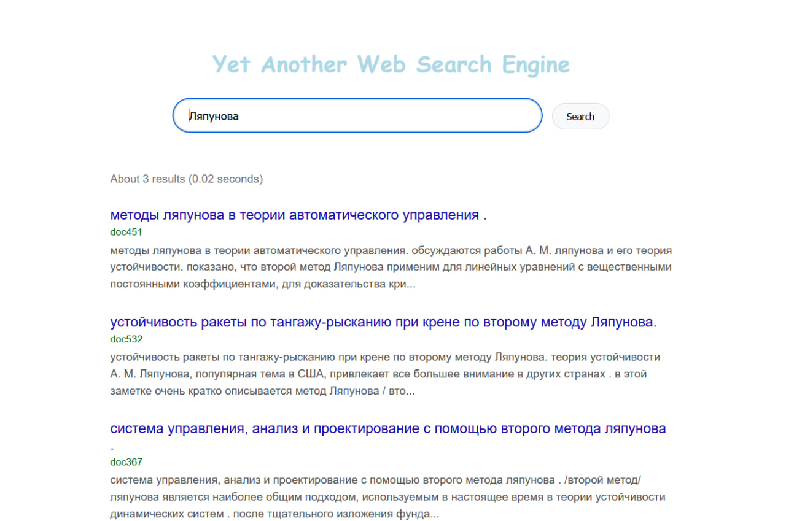
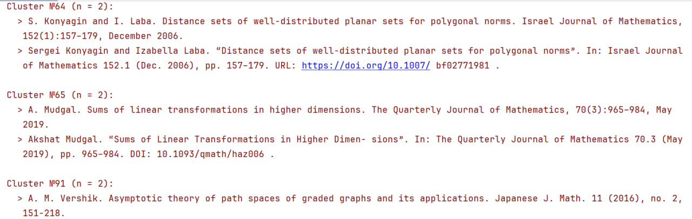
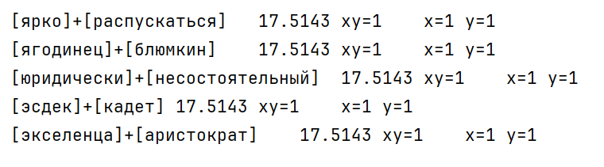
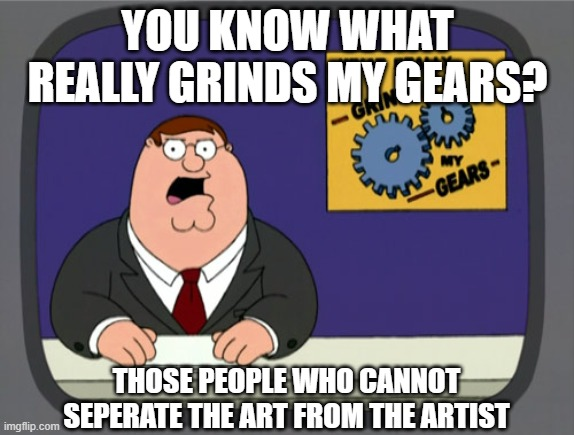

# nlp-labs-spring-2025

Игрушечные примеры для курса обработки языка.

Это не домашние работы, это "вопросы для самопроверки в конце главы". Здесь нет готовых и "правильных" решений, но есть некоторые *вызовы*, на которые можно отвечать, пользуясь тем, что узнали на лекциях, и здравым смыслом. Попробуйте!

## 01. Информационный поиск

## 02. Обработка строк

## 03. Элементы теории информации

## 04. N-граммные языковые модели

[ПРОПУСК]

## 05. Векторная семантика

## 06. Разметка последовательностей

## ???

